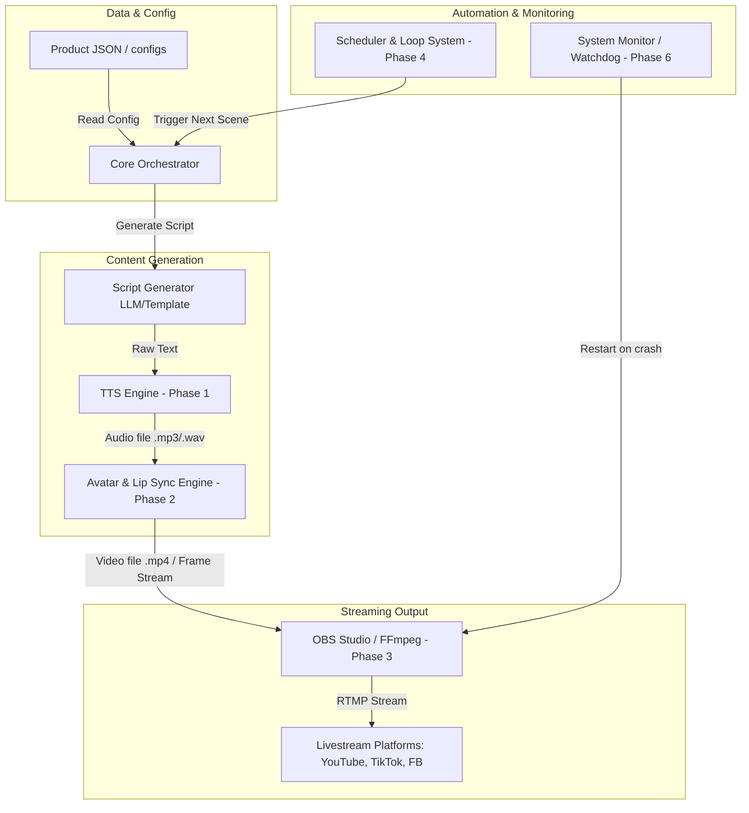

# System Architecture (ARCHITECTURE.md)

Tài liệu này mô tả kiến trúc tổng thể của hệ thống AI MC (AI Live Stream MC).

---

## 🏗️ Sơ Đồ Khối Hệ Thống (System Architecture Diagram)

Hệ thống được chia thành các module độc lập tương tác với nhau thông qua dữ liệu đầu vào/đầu ra rõ ràng:



---

## 📂 Cấu Trúc Mã Nguồn (Project Structure)

Dự án được tổ chức theo chuẩn cấu trúc module hóa Python:

```text
AI_MC/ (E:/MC AI/)
├── assets/             # Chứa hình ảnh Avatar, video mẫu, nhạc nền.
├── configs/            # Chứa các tệp cấu hình YAML/JSON (ví dụ: default.yaml).
├── docs/               # Tài liệu dự án (Roadmap, Phases, Sprints, Decisions...).
│   ├── PHASES/
│   ├── SPRINTS/
│   ├── ARCHITECTURE.md
│   ├── DECISIONS.md
│   ├── ROADMAP.md
│   ├── TASKS.md
│   └── CHANGELOG.md
├── logs/               # Thư mục chứa log phát sinh khi chạy ứng dụng.
├── scripts/            # Các scripts chạy một lần hoặc script setup môi trường.
├── src/                # Mã nguồn ứng dụng chính.
│   ├── __init__.py
│   ├── main.py         # Entrypoint của chương trình.
│   ├── voice/          # Module xử lý TTS (Phase 1).
│   ├── avatar/         # Module xử lý Lip Sync & Avatar Render (Phase 2).
│   ├── streaming/      # Module tích hợp OBS/FFmpeg (Phase 3).
│   ├── automation/     # Module lập lịch, playlist (Phase 4).
│   └── utils/          # Các module tiện ích (logger, config, path helpers).
├── tests/              # Mã nguồn kiểm thử (unit tests, integration tests).
├── .gitignore          # Cấu hình bỏ qua các tệp không cần quản lý bởi Git.
├── README.md           # Hướng dẫn nhanh cho dự án.
└── requirements.txt    # Danh sách các gói thư viện Python cần thiết.
```

---

## ⚙️ Các Thành Phần Chính (Key Components)

1.  **Core Orchestrator (`src/main.py`)**: Điều phối luồng hoạt động từ lúc khởi chạy, đọc cấu hình, gọi các module sinh nội dung và điều khiển stream.
2.  **Config Manager (`src/utils/config.py`)**: Đọc và phân tích tệp cấu hình YAML ở `configs/`, tự động merge với các cấu hình môi trường hoặc thiết lập mặc định.
3.  **Logger (`src/utils/logger.py`)**: Sử dụng thư viện `logging` tiêu chuẩn để ghi log đa luồng, hỗ trợ xoay vòng tệp log (RotatingFileHandler) để tránh tràn bộ đĩa.
