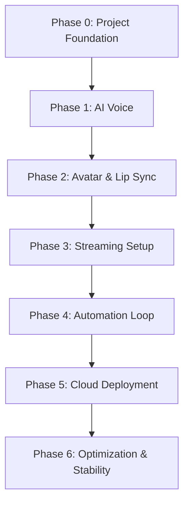

# AI Live Stream MC - Project Roadmap

Tài liệu này phác thảo lộ trình phát triển tổng thể cho dự án **AI MC** (Hệ thống Livestream MC ảo tự động).

---

## 📌 Lộ Trình Tổng Quan (Overall Roadmap)

| Phase | Tên Giai Đoạn | Mục Tiêu Chính | Trạng Thái |
| :--- | :--- | :--- | :--- |
| **Phase 0** | [Foundation](PHASES/PHASE_00.md) | Khởi tạo cấu trúc dự án, môi trường phát triển, logging & config. | **Đang Thực Hiện** |
| **Phase 1** | [AI Voice](PHASES/PHASE_01.md) | Chuyển đổi văn bản thành giọng nói (TTS) chất lượng cao. | *Chưa Bắt Đầu* |
| **Phase 2** | [Avatar](PHASES/PHASE_02.md) | Đồng bộ môi (Lip Sync) và tạo video chuyển động nhân vật. | *Chưa Bắt Đầu* |
| **Phase 3** | [Streaming](PHASES/PHASE_03.md) | Tích hợp OBS Studio / FFmpeg để phát sóng lên các nền tảng. | *Chưa Bắt Đầu* |
| **Phase 4** | [Automation](PHASES/PHASE_04.md) | Tự động hóa kịch bản, chạy vòng lặp livestream không cần can thiệp. | *Chưa Bắt Đầu* |
| **Phase 5** | [Cloud Deployment](PHASES/PHASE_05.md) | Triển khai hệ thống lên GPU Cloud (Windows Server / Ubuntu). | *Chưa Bắt Đầu* |
| **Phase 6** | [Optimization](PHASES/PHASE_06.md) | Tối ưu FPS, Bitrate, tài nguyên phần cứng, tự khởi động lại khi lỗi. | *Chưa Bắt Đầu* |

---

## 🛠️ Triết Lý Phát Triển & Quy Trình

Dự án tuân thủ quy trình phát triển lặp (Iterative Development), chia nhỏ các giai đoạn thành các Sprint từ 3-7 ngày (hoặc theo cấu hình thực tế). Mỗi Sprint tập trung giải quyết một tính năng chạy được (Runnable Deliverable) và kết thúc bằng một kiểm thử đánh giá đạt chuẩn **Definition of Done (DoD)**.

Để quản lý dự án hiệu quả, chúng ta sử dụng cấu trúc tài liệu sau:
*   [ROADMAP.md](ROADMAP.md): Bức tranh tổng thể (Tài liệu này).
*   [PHASES/](PHASES/): Chi tiết mục tiêu, phạm vi và tiêu chí hoàn thành của từng Phase.
*   [SPRINTS/](../SPRINTS/): Chi tiết các nhiệm vụ cụ thể cho từng chu kỳ nước rút.
*   [DECISIONS.md](DECISIONS.md): Ghi nhật ký các quyết định kỹ thuật và lý do lựa chọn.
*   [ARCHITECTURE.md](ARCHITECTURE.md): Sơ đồ thiết kế và kiến trúc kỹ thuật của hệ thống.
*   [TASKS.md](TASKS.md): Danh sách việc cần làm hiện tại và trạng thái chi tiết.
*   [CHANGELOG.md](CHANGELOG.md): Lịch sử cập nhật của dự án.
